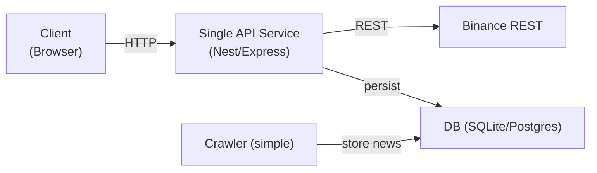
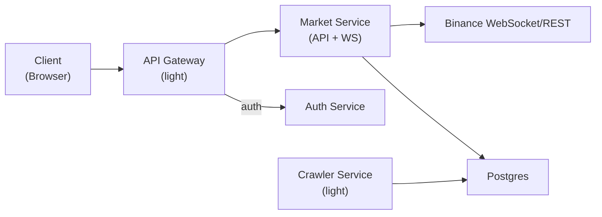
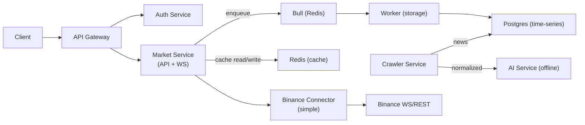
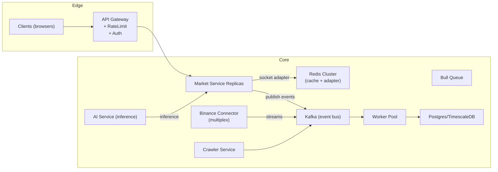
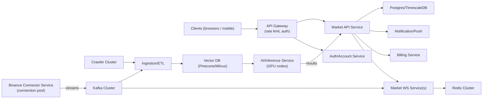

# Kiến trúc theo cấp độ — Market Service (có các Service khác)

Bản này mô tả 4 cấp kiến trúc (từ đơn giản → production microservices) nhưng khác với bản trước là ở mỗi cấp ta hiển thị toàn bộ hệ thống gồm nhiều service liên quan (Auth, API Gateway, Crawler, AI, Binance Connector, Notification, v.v.) và kèm ước lượng số user/connection.

---

## Mức 0 — PoC (hệ thống nhiều service nhưng simple)

Mục tiêu: demo chức năng cơ bản, service nhỏ, chưa scale.

Sơ đồ (Mermaid):

Giải thích & sizing (ước lượng):

- Số user: 1 - 50 (dev/demo)
- Concurrent WS: nếu có, < 50
- Subscriptions/user: 1-2
- Outbound streams: trực tiếp REST calls, low RPS (< 10)

Khi đủ yêu cầu: nâng lên Mức 1 để có realtime và persistence tốt hơn.

---

## Mức 1 — Ứng dụng đơn tiến trình với các service phụ tối thiểu

Mục tiêu: cung cấp realtime cơ bản, có Auth & basic Crawler.

Sơ đồ (Mermaid):

Giải thích & sizing (ước lượng):

- Số user: 10 - 200 active
- Concurrent WS: 10 - 200
- Subscriptions/user: 1 - 3 → tổng subs ~10 - 600
- Outbound connections: nếu server mở per-subscription, outbound ~subscriptions (risk of explosion).

Vấn đề: khi users tăng, outbound connections và DB blocking sẽ là bottleneck.

---

## Mức 2 — Cache + Queue + Service phân vai (Auth, Market, Crawler, AI (sớm))

Mục tiêu: giảm latency, không block, tách concerns cơ bản.

Sơ đồ (Mermaid):

Giải thích & sizing (ước lượng):

- Số user: 200 - 2,000 active
- Concurrent WS: 200 - 2,000
- Subscriptions total: 200 - 10,000
- Outbound streams: aim to multiplex; with caching most reads served from Redis (cache hit target >70%)

Đặc điểm: có Queue/Worker để tránh blocking, Crawler chuẩn bị dữ liệu cho AI offline.

---

## Mức 3 — Multiplexing + Socket Clustering + Event Bus (hiện tại / production-ready)

Mục tiêu: đáp ứng hàng nghìn → hàng chục nghìn users, resilient WS, scale ngang.

Sơ đồ (Mermaid):

Giải thích & sizing (ước lượng):

- Số user: 2,000 - 100,000 active (tùy infra)
- Concurrent WS: 2k - 100k (chia trên replicas)
- Subscriptions/user: 1 - 10 → total subscriptions 2k - 1M
- Unique streams (symbol, interval) U: vài trăm → vài ngàn (điều quan trọng để multiplex)
- Fanout: internal messages/sec ≈ total_subs \* update_rate; ticker fanout có thể lớn (use delta/aggregation)

Lý do dừng ở mức này: nó cung cấp

- multiplexing để giảm outbound sockets,
- socket.io Redis adapter để scale ngang,
- queue & worker cho persistence, và
- event bus để tách concerns mà không phải tách toàn bộ codebase ngay lập tức.

---

## Mức 4 — Microservices hoàn chỉnh (tách rõ Market, Connector, Crawler, AI, Auth, Notification, Billing)

Mục tiêu: scale cho hàng trăm nghìn → triệu user, tách trách nhiệm, enable MLOps.

Sơ đồ (Mermaid):

Giải thích & sizing (ước lượng):

- Số user: 50k - 1M+ active
- Concurrent WS: 50k - 1M
- Subscriptions: tens/hundreds of thousands → millions
- Unique outbound streams: vẫn hàng nghìn; Connector service tối ưu quản lý connection pool
- Event bus (Kafka) handle fanout và persist events; VectorDB phục vụ embedding queries

Lý do chuyển lên mức này: cần cho các yêu cầu phân tích nâng cao (AI realtime), tenant isolation, billing & quota, và để hệ thống có thể scale đến hàng trăm nghìn user với SLA cao.

---

## Phần kết

Tài liệu này mở rộng các sơ đồ trên bằng việc thêm các service liên quan ở từng cấp độ, giúp team thấy rõ đường đi khi mở rộng hệ thống từ PoC tới microservices hoàn chỉnh. Nếu bạn muốn, tôi có thể:

- Xuất từng sơ đồ Mermaid sang PNG/SVG;
- Tổng hợp bảng sizing (CSV/Markdown) cho từng kịch bản (moderate/large/huge);
- Sinh kịch bản load-test (k6 hoặc locust) theo thông số sizing mẫu.

Bạn chọn bước tiếp theo nào?
