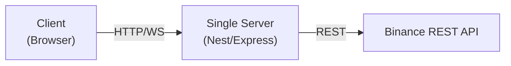
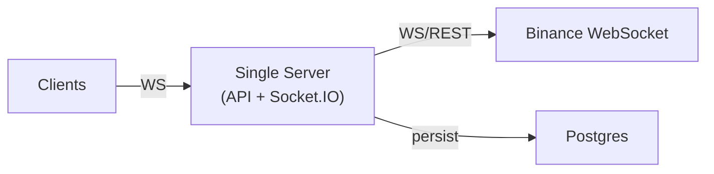
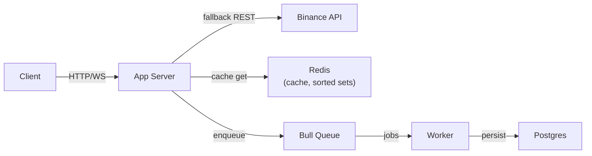
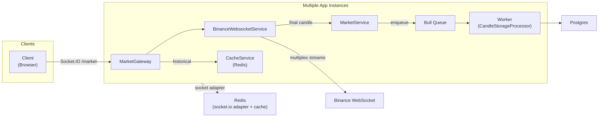
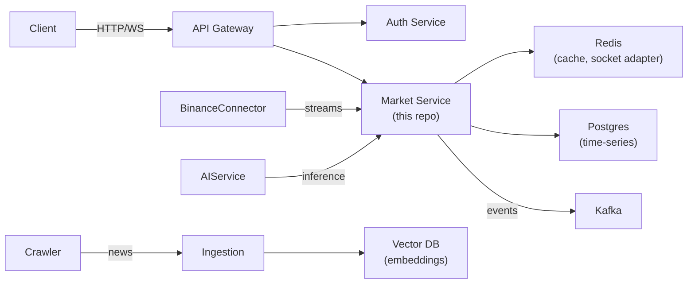

# Báo cáo kiến trúc — Market Service

_Phiên bản hiện tại của repo `market-service` (nhánh `local/architecture`) được coi là phiên bản cuối cùng của `Market Service` trong hệ thống microservices. Báo cáo này mô tả lộ trình nâng cấp kiến trúc từ đơn giản đến microservices, tập trung phân tích chi tiết `market-service`._

---

## Nội dung

- Tổng quan và mục tiêu
- Mức 0 — PoC (Bản mẫu tối giản)
- Mức 1 — Ứng dụng đơn tiến trình có WebSocket
- Mức 2 — Cache & Background Queue
- Mức 3 — Scale WebSocket & Multiplexing (phiên bản repo hiện tại)
- Mức 4 — Kiến trúc Microservices (Phiên bản cuối cùng)
- So sánh các mức, lý do nâng cấp, vấn đề được giải quyết
- Luồng dữ liệu mẫu (subscribe BTCUSDT/1m)
- Kiến nghị triển khai, vận hành, monitoring

---

## Tóm tắt ngắn gọn

Mục tiêu: mô tả quá trình nâng cấp kiến trúc hệ thống phục vụ hiển thị biểu đồ giá realtime (candles/tickers), thu thập tin tức tài chính, và pipeline AI. Repo hiện tại đại diện cho `Market Service` phiên bản production-ready: gồm REST API, WebSocket gateway, Redis cache, Bull queue, Postgres persistence, và logic multiplex WebSocket đến Binance.

---

## Mức 0 — PoC (Bản mẫu tối giản)

Mục tiêu: minh họa ý tưởng, nhanh làm demo.

- Thành phần: Single Server (Nest/Express), client (browser), gọi trực tiếp Binance REST để lấy candles/tickers.
- Không cache, không queue, không WebSocket (hoặc WebSocket đơn giản polling).

Sơ đồ (Mermaid):

Vấn đề:
- Không realtime hoặc realtime yếu nếu chỉ polling.
- Không scale, độ trễ cao khi số người dùng tăng.

Khi nào nâng cấp: cần realtime hoặc muốn giữ lịch sử nến.

### Chi tiết kết nối người dùng & quy mô (Mức 0)

- Giả định số user: 1 - 10 (dev/demo).
- Kết nối: hầu hết là HTTP request; nếu có WebSocket sẽ phục vụ < 50 concurrent connections.
- Subscription pattern: mỗi user thường request 1-2 cặp tiền tại một thời điểm.
- Outbound connections tới Binance: mỗi API call trực tiếp (thường không có persistent WS), khoảng requests per second thấp (< 5 rps).
- Thắt cổ chai: API rate limit, latency từ Binance, không có cache dẫn tới chi phí cao khi load test.
---

## Mức 1 — Ứng dụng đơn tiến trình có WebSocket

Mục tiêu: cung cấp realtime cơ bản cho vài chục client.

- Thành phần: Single Server (HTTP + Socket.IO), Postgres (hoặc SQLite) giữ lịch sử nến.
- Server có thể mở kết nối WS tới Binance per-subscription (đơn giản, không multiplex).

Sơ đồ:

Vấn đề:
- Mỗi client/subscription có thể tạo nhiều kết nối outbound tới Binance → không scale.
- DB writes blocking nếu không tách worker.

Khi nào nâng cấp: số lượng client tăng cần tối ưu kết nối và hiệu suất lưu trữ.

### Chi tiết kết nối người dùng & quy mô (Mức 1)

- Giả định số user: 10 - 200 active users.
- Kết nối WebSocket: 10 - 200 concurrent WS connections (1 WS per client).
- Subscription pattern: trung bình 1-3 subscriptions/client (ví dụ: BTCUSDT, ETHUSDT, 1m + 5m).
- Outbound connections tới Binance: nếu server cho mỗi subscription mở 1 kết nối outbound, số kết nối outbound ≈ số subscriptions (10-600) — dễ dẫn tới connection explosion.
- Thắt cổ chai: outbound connections tới Binance, memory/CPU trên server khi nhiều WS đồng thời, blocking DB writes nếu không dequeue.
---

## Mức 2 — Cache & Background Queue

Mục tiêu: giảm latency, giảm call tới Binance, xử lý persistence không block.

- Thêm Redis cache cho symbols/tickers/candle history (sorted sets cho nến gần nhất).
- Thêm Bull (Redis) queue để xử lý lưu nến không block và retry.
- Dùng cron job để cleanup historical data.

Sơ đồ:

Giải pháp đạt được:
- Giảm số cuộc gọi trùng lặp tới Binance.
- Giảm độ trễ bằng cache.
- DB writes không block luồng realtime.

Trong repo hiện tại: `CacheModule`/`CacheService`, `BullModule` queue `candle-storage`, cron cleanup (xem `MarketService@cleanupOldCandles`).

### Chi tiết kết nối người dùng & quy mô (Mức 2)

- Giả định số user: 200 - 2,000 active users.
- Concurrent WS connections: 200 - 2,000.
- Subscriptions: trung bình 1-5 subscriptions/client → tổng subscriptions 200 - 10,000.
- Outbound connections tới Binance: với caching và reuse, thiết kế tối ưu là reuse REST & WS; nếu vẫn 1:1 thì sẽ gây quá tải. Sau khi cache+queue, nhiều requests trả từ Redis nên load lên Binance giảm sâu (cache hit ratio mục tiêu > 70%).
- Hệ thống queue: Bull queue có thể xử lý hàng trăm - vài ngàn jobs/giờ trên một node Redis; nếu cần throughput lớn hơn, scale worker instances.
- Thắt cổ chai: Redis capacity (memory), worker throughput, DB write throughput.
---

## Mức 3 — Scale WebSocket & Multiplexing (Phiên bản repo hiện tại)

Mục tiêu: xử lý hàng nghìn kết nối client bằng cách multiplex outbound streams và scale app instances.

Đặc điểm chính:
- `BinanceWebsocketService` quản lý kết nối outbound theo `symbol:interval`, multiplex `@kline` + `@ticker` stream và broadcast tới các client nội bộ.
- `MarketGateway` (Socket.IO namespace `/market`) giữ `clientSubscriptions` và đăng ký callback cho mỗi client; khi có dữ liệu, gateway phát sự kiện tới client.
- Sử dụng `RedisIoAdapter` (socket.io-redis) để scale Socket.IO qua nhiều app instances.
- Cấu trúc queue và worker lưu final candles (Bull + Redis + Processor), cache sorted sets để truy vấn history nhanh.

Sơ đồ (phiên bản repo):

### Chi tiết kết nối người dùng & quy mô (Mức 3)

- Giả định số user: 2,000 - 100,000 active users (tùy infra).
- Concurrent WS connections tổng: 2,000 - 100,000 (chia đều trên nhiều app instances).
- Subscriptions trung bình: 1-10 subscriptions/user → tổng subscriptions có thể 2,000 - 1,000,000.
- Outbound connections tới Binance: với `BinanceWebsocketService` multiplex theo `symbol:interval`, số outbound connections ≈ số unique (symbol, interval) combinations đang theo dõi (ví dụ 500 symbols × 4 intervals = 2,000 outbound streams). Đây là điểm quan trọng: multiplexing giảm từ O(subscriptions) xuống O(unique streams).
- Socket.IO scale: Redis adapter cho phép nhiều app instances chia sẻ rooms và events; mỗi instance chỉ cần xử lý client local connections và subscribe vào vùng stream chung.
- Worker & queue: Bull + Redis cần scale ngang bằng với số job per second (ứng với số final candles). Với 1k symbols ở 1m interval, final candles/sec ≈ 1000/60 ≈ 16 rps; lưu thành batch giúp giảm tải DB.
- Thắt cổ chai: Redis network I/O (socket adapter + cache), CPU/memory của app instances, bandwidth cho outbound WS tới Binance, DB write throughput nếu không batch/partition.

Kết luận đo lường:
- Nếu muốn phục vụ 50k concurrent users với trung bình 3 subscriptions mỗi user, cần:
  - App instances: tens-of-nodes (tùy công suất mỗi node). Ví dụ, nếu 1 node xử lý 2k WS, cần ~25 nodes.
  - Redis cluster: để phục vụ cache + socket adapter + Bull (một cluster hoặc tách thành Redis cho cache + Redis cho adapter/queue).
  - DB: Partitions / TimescaleDB để lưu lượng insert lớn.

Mapping code (repo):
- `MarketGateway` — [src/modules/market/market.gateway.ts]
- `BinanceWebsocketService` — [src/modules/binance/binance-websocket.service.ts]
- `MarketService` — [src/modules/market/market.service.ts]
- `RedisIoAdapter` — [src/adapters/redis-io.adapter.ts]
- `BullModule` queue `candle-storage` — [src/modules/market/market.module.ts]

Vấn đề được giải quyết:
- Giảm số kết nối outbound đến Binance (multiplexing).
- Hỗ trợ horizontal scaling Socket.IO bằng Redis adapter.
- Xử lý persistence không block và có retry.
- Tăng độ bền kết nối (heartbeat, backoff, reconnect).

---

## Mức 4 — Kiến trúc Microservices (Phiên bản cuối cùng)

Mục tiêu: tách domain thành các services độc lập để dễ scale, deploy, và vận hành AI pipeline.

Các service đề xuất:
- API Gateway / Reverse Proxy (nginx / Kong)
- Auth & Account Service (user, VIP / free)
- Market Service (repo hiện tại) — REST + WS + cache + queue + DB
- Binance Connector Service (tách WebSocket connector ra nếu cần)
- Crawler Service (thu thập tin tức) với Structure Learner
- Ingestion/ETL Service (normalizer, align news <-> prices)
- AI/Inference Service (host models, embedding, causal analysis)
- Event Bus (Kafka / RabbitMQ / Redis Streams)
- Notification / Push Service
- Frontend (SPA)

Sơ đồ tổng thể microservices:

### Chi tiết kết nối người dùng & quy mô (Mức 4)

- Giả định số user: 50,000 - 1,000,000+ active users (scale lớn tùy doanh nghiệp).
- Concurrent WS connections: 50k - 1M (phân bổ qua nhiều Market Service instances trước Redis adapter).
- Subscriptions: trung bình 2-10 subscriptions/user → tổng subscriptions có thể 100k - 10M.
- Outbound connections tới Binance: duy trì số outbound streams bằng số unique (symbol, interval) — thường ở hàng nghìn; tuy nhiên nếu số subscriptions lớn hơn unique streams, multiplexing tiếp tục mang lại lợi ích lớn.
- Kiến trúc: tách `Binance Connector` (hoặc sử dụng managed stream aggregator) để chịu trách nhiệm giữ kết nối tới Binance (connection pool chuyên dụng). Market Service nhận dữ liệu qua Kafka/Redis Streams thay vì giữ kết nối trực tiếp.
- Scaling notes:
  - API Gateway + Auth: rate limit, edge caching.
  - Market Service: nhiều replica, HPA, mỗi replica xử lý local WS và subscribe từ event bus.
  - Event Bus (Kafka) để truyền tải lượng events khổng lồ, giảm coupling.
  - AI Service & Crawler: có thể sử dụng GPU nodes, batch inference.
- Thắt cổ chai: network egress (nhiều clients), Kafka cluster sizing, vector DB throughput cho embeddings, và orchestration của stateful services.

Kết luận đo lường:
- Với target 200k concurrent users (avg 3 subscriptions): ~600k subscriptions. Nếu unique streams = 2k, outbound streams vẫn chỉ ~2k, nhưng throughput nội bộ (fanout) cần xử lý ~600k messages/sec (tùy frequency) — cần event bus và nhiều consumer/app instances để phân phối tải.

Lợi ích:
- Scale độc lập từng service theo nhu cầu.
- Tách rõ trách nhiệm (crawler, inference, market streaming).
- Dễ triển khai MLOps cho AI pipeline.

---

## So sánh các mức & lý do nâng cấp

- Mức 0 → Mức 1: cần realtime → thêm WebSocket.
- Mức 1 → Mức 2: cần giảm latency & blocking → thêm Redis + Bull queue.
- Mức 2 → Mức 3: cần scale số kết nối & resilient connections → multiplex WebSocket + socket.io Redis adapter.
- Mức 3 → Mức 4: cần deploy độc lập, MLOps & event-driven → chuyển sang microservices, event bus.

---

## Luồng dữ liệu mẫu: client subscribe `BTCUSDT/1m` (phiên bản repo hiện tại)

1. Client gửi `subscribe` đến `MarketGateway` (`/market`).
2. `MarketGateway.handleSubscribe` lưu subscription và gọi `BinanceWebsocketService.subscribe(symbol, interval, clientId, onCandle, onTicker)`.
3. Nếu có historical data trong Redis, `MarketGateway` trả `historical-data` từ `CacheService.getCandleHistory`.
4. `BinanceWebsocketService` đảm nhiệm connection multiplex, khi nhận message:
   - Chuyển raw kline -> candleData
   - Nếu `isFinal` (k.x === true), gọi `MarketService.storeFinalCandle(...)` để enqueue job lưu vào DB.
   - Gọi callback để `MarketGateway` emit `candle-update` tới client.
5. Worker (`CandleStorageProcessor`) lấy job từ Bull queue và lưu vào Postgres (bulk insert / orIgnore).

---

## Các rủi ro, đề xuất production-readiness

1. Observability:
   - Export metrics Prometheus (WS connections, queue depth, job failures, cache hit ratio).
   - Tracing (OpenTelemetry) cho luồng events.
2. Resilience:
   - Circuit breaker & fallback mode nếu Binance unreachable.
   - Graceful degradation: fallback sang REST polling.
3. Storage:
   - Partitioning/TimescaleDB cho time-series lớn.
4. Scaling:
   - Nếu >100k concurrent, cân nhắc tách `BinanceWebsocketService` thành `Binance Connector` service.
   - Dùng Kafka/Redis Streams cho event bus khi throughput cao.
5. Security:
   - Auth trên WS (JWT) để phân biệt free/VIP.
   - Secrets management (Vault/K8s secrets).
6. AI Pipeline:
   - Crawler (structure learner) tạo template trích xuất → lưu raw news + normalized content.
   - Embedding -> Vector DB (Pinecone/Milvus) -> AI Service cho inference.

---

## Các file / module quan trọng trong repo (mapping)

- `src/modules/market/market.service.ts` — logic REST/caching/queue/persistence
- `src/modules/market/market.gateway.ts` — Socket.IO gateway `/market`
- `src/modules/binance/binance-websocket.service.ts` — multiplexed Binance WS manager
- `src/adapters/redis-io.adapter.ts` — Socket.IO Redis adapter
- `src/modules/market/market.module.ts` — queue registration `candle-storage`
- `src/app.module.ts`, `src/main.ts` — bootstrapping, global pipes, swagger, websocket adapter

(Truy cập nhanh vào những file này để minh chứng cho thiết kế hiện tại.)

---

## Roadmap & Next Steps

- Ngay lập tức:
  - Bật metrics Prometheus cho WS/queue.
  - Thêm health checks cho các connection pools.
- Trung hạn:
  - Triển khai staging multi-instance với Redis adapter; stress test WebSocket.
  - Xem xét tách `BinanceWebsocketService` nếu cần giảm coupling.
- Dài hạn:
  - Build crawler + ingestion + AI pipeline; triển khai Vector DB và inference service; tích hợp VIP features.

---

## Kết luận

Repo hiện tại đã đáp ứng hầu hết yêu cầu cho một `Market Service` production-ready: cache-first, queue-based persistence, multiplexed WS, socket clustering, cron cleanup. Để tiến lên kiến trúc microservices hoàn chỉnh cần tách trách nhiệm, triển khai event bus, và xây dựng pipeline AI độc lập.

---

*File này được tạo tự động bởi trợ lý; nếu bạn muốn tôi xuất nó thành PDF/slide hoặc vẽ sơ đồ PNG, tôi có thể sinh thêm.*
