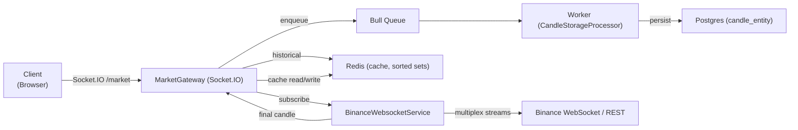
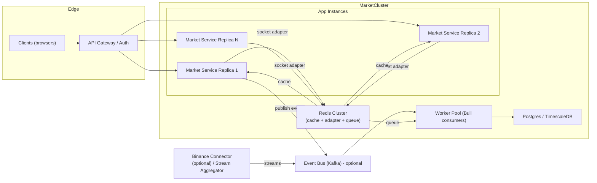

# Báo cáo chi tiết — Kiến trúc hiện tại của Market Service

Phiên bản: `market-service` (nhánh `local/architecture`) — báo cáo này mô tả chi tiết kiến trúc hiện tại của `Market Service`, giải thích các quyết định kiến trúc chính, các lợi thế, giới hạn và lý do vì sao có thể dừng phát triển thêm (tạm thời) ở phiên bản này.

---

## 1. Tóm tắt điều hành

`Market Service` hiện tại là một service độc lập đảm trách: cung cấp REST API cho symbols/tickers/candles, gateway WebSocket namespace `/market` cho real-time updates, cache layer (Redis), job queue (Bull/Redis) cho persistence, và database PostgreSQL cho lưu trữ lịch sử nến.

Những điểm mạnh chính:

- Thiết kế cache-first giảm latency và giảm số cuộc gọi tới Binance.
- Multiplexed WebSocket connections tới Binance giảm số outbound connections (tối ưu cho scale).
- Socket.IO + Redis adapter cho phép scale ngang WebSocket across instances.
- Non-blocking persistence (Bull queue) giúp hệ thống real-time không bị chặn bởi DB writes.
- Health/operational hooks (cron cleanup, connection health reporting) sẵn có.

Kết luận: đây là một kiến trúc production-ready cho tính năng hiển thị biểu đồ realtime và lưu trữ lịch sử. Nếu thiếu thời gian cho những nâng cấp lớn, dừng ở phiên bản này là hợp lý vì nó đã bao gồm hầu hết patterns cần thiết để vận hành ổn định ở quy mô vừa và lớn.

---

## 2. Thành phần chính và mapping code

- WebSocket Gateway:
  - `MarketGateway` — [src/modules/market/market.gateway.ts](src/modules/market/market.gateway.ts#L1-L400)
  - Nhiệm vụ: nhận subscribe/unsubscribe từ client, quản lý `clientSubscriptions`, gửi historical data từ cache và phát realtime updates.

- Binance stream manager:
  - `BinanceWebsocketService` — [src/modules/binance/binance-websocket.service.ts](src/modules/binance/binance-websocket.service.ts#L1-L800)
  - Nhiệm vụ: multiplex các stream `symbol:interval`, quản lý kết nối (reconnect, heartbeat, backoff), broadcast dữ liệu cho callbacks nội bộ.

- API + Business logic:
  - `MarketService` — [src/modules/market/market.service.ts](src/modules/market/market.service.ts#L1-L400)
  - Nhiệm vụ: cache-first retrieval, gọi Binance REST khi cache miss, enqueue final candles vào queue, cleanup cron.

- Cache + Queue + Persistence:
  - `CacheModule` / `CacheService` (Redis) — lưu lịch sử nến bằng sorted sets, cache tickers/symbols.
  - `BullModule` queue `candle-storage` + `CandleStorageProcessor` — xử lý job lưu nến vào Postgres.
  - `TypeOrmModule` và `CandleEntity` — Postgres persistence.

- Socket.IO clustering adapter:
  - `RedisIoAdapter` — [src/adapters/redis-io.adapter.ts](src/adapters/redis-io.adapter.ts#L1-L200)
  - Nhiệm vụ: cho phép nhiều app instances chia sẻ rooms và broadcast qua Redis.

- Boot & config:
  - `src/app.module.ts` (bootstrap các module), `src/main.ts` (đăng ký Redis adapter, pipes, filters, Swagger)

---

## 3. Luồng dữ liệu chính (khi client subscribe)

1. Client kết nối Socket.IO tới namespace `/market` và gửi `subscribe` cho `symbol`+`interval`.
2. `MarketGateway.handleSubscribe` lưu subscription cho client và gọi `BinanceWebsocketService.subscribe(...)`.
3. `MarketGateway` trả historical data ngay từ `CacheService.getCandleHistory(...)` nếu có (fast path).
4. `BinanceWebsocketService` quản lý kết nối outbound tới Binance (multiplex streams). Khi nhận data:
   - Nếu là kline (candle): chuyển thành object candleData.
   - Nếu `isFinal` (k.x === true): gọi `MarketService.storeFinalCandle(...)` để enqueue job lưu vào queue `candle-storage`.
   - Gọi callback truyền vào `subscribe` để `MarketGateway` emit `candle-update` tới client.
5. Worker `CandleStorageProcessor` xử lý job từ Bull queue và lưu batch vào Postgres.

Diagram (tóm tắt): Client -> MarketGateway -> BinanceWebsocketService -> Binance WS
|-> Cache (Redis)
|-> Queue (Bull) -> Worker -> Postgres

---

### Sơ đồ kiến trúc (Mermaid)

### Sơ đồ triển khai scale (Mermaid)

## 4. Tại sao kiến trúc hiện tại là "tốt đủ" (vì sao có thể dừng ở đây)

1. Maturity của patterns:
   - Sử dụng cache-first, queue-based persistence, và multiplexing là những pattern đã được chứng minh cho hệ thống realtime/time-series.
   - Tích hợp Socket.IO + Redis adapter là lộ trình chuẩn để scale websocket horizontally.

2. Availability & Fault-tolerance:
   - `BinanceWebsocketService` có reconnect, exponential backoff, heartbeat/pong detection — giảm khả năng downtime silent.
   - Job queue có retry và removeOnComplete, đảm bảo dữ liệu final không bị mất khi lưu.

3. Performance & Scalability:
   - Multiplexing giảm số outbound streams từ O(subscriptions) -> O(unique streams), là cải tiến bước nhảy để tiết kiệm socket resources.
   - Cache (Redis sorted sets) cho phép trả historical data nhanh mà không gây tải DB.
   - DB writes được tách ra worker, giảm blocking I/O trong luồng realtime.

4. Operability:
   - Cron cleanup đã có để kiểm soát retention (giảm disk usage).
   - Swagger, global filters, validation pipes giúp devops và dev dễ test và vận hành.

5. Business readiness:
   - Hỗ trợ đa cặp, đa khung thời gian, realtime và historical data — đáp ứng tính năng core cho người dùng (chart + tickers + history).
   - Có điểm mở (extension points): crawler, AI pipeline, tách connector nếu cần.

Kết luận: kiến trúc hiện tại đã bao gồm đủ thành phần cốt lõi để vận hành dịch vụ biểu đồ real-time cho sản phẩm, với trade-offs rõ ràng và các cơ chế giảm rủi ro trong trường hợp traffic tăng. Vì vậy, trong điều kiện "không còn thời gian" để tách microservices hoặc làm refactor lớn, dừng phát triển ở phiên bản này là hợp lý và an toàn.

---

## 5. Phân tích quy mô & tính toán kết nối (Sizing)

Phần này đưa ra công thức đơn giản và ví dụ ước lượng để suy ra số connection, subscriptions và throughput cần xử lý.

- Ký hiệu:
  - N = số concurrent users (sockets) đang kết nối.
  - s = trung bình subscriptions per user (số cặp mà mỗi user theo dõi).
  - U = số unique streams (unique (symbol, interval)) thực tế.
  - f = tần suất update per subscription (updates/second). Ví dụ: ticker ~1 rps, 1m candle final ~1/60 rps.

- Công thức cơ bản:
  - Concurrent WS connections ≈ N
  - Total subscriptions = N \* s
  - Outbound streams to Binance ≈ U (độ lớn sau multiplexing)
  - Internal messages per second (fanout) ≈ Total subscriptions \* f
  - Final candle DB inserts per second ≈ U / interval_seconds (ví dụ interval 60s => U/60)

Ví dụ mẫu 1 (moderate):

- N = 50,000 users
- s = 3 subscriptions/user
- U = 2,000 unique streams
- f_candle (1m final) = 1/60 ≈ 0.0167 rps
- f_ticker = 1 rps

- Concurrent WS connections = 50,000
- Total subscriptions = 150,000
- Outbound streams = 2,000 (thay vì 150,000 nếu không multiplex)
- Candle final internal messages/sec ≈ 2,000 \* 0.0167 ≈ 33 rps
- Ticker internal messages/sec ≈ 150,000 \* 1 = 150,000 rps (nếu server phải gửi ticker updates cho mỗi subscription every second)

Gợi ý: dùng aggregation/batching và client-side sampling to reduce ticker fanout (ví dụ push only changed tickers, hoặc giảm ticker frequency for free users).

Ví dụ mẫu 2 (large):

- N = 200,000 users
- s = 3
- U = 3,000

- Concurrent WS connections = 200,000
- Total subscriptions = 600,000
- Outbound streams = 3,000
- Candle final internal messages/sec ≈ 3,000/60 = 50 rps
- Ticker internal messages/sec ≈ 600,000 rps

Những hệ số cần lưu ý:

- Nếu ticker frequency quá cao, fanout volume là thách thức chính — giải pháp: per-room broadcast (Socket.IO rooms), delta updates, rate-limiting, hoặc edge caching (CDN/edge WebSocket).
- DB writes: với U = 3,000 at 1m, DB insert ≈ 50 rps. Batch inserts và partitioning có thể dễ dàng xử lý mức này; vấn đề thực sự là fanout tới clients.

Sizing recommendations (tóm tắt):

- App instances: xác định bằng số WS mỗi node có thể xử lý; nếu 1 node ~2k WS thì cho N=50k cần ~25 nodes.
- Redis: tách instances cho cache vs adapter vs queue hoặc dùng Redis cluster.
- Worker pool: đảm bảo throughput xử lý jobs tương đương final candles/sec với headroom (nhân 2-3 lần để dự phòng).

## 5. Trade-offs / Những hạn chế còn tồn và cách giảm thiểu (nếu không nâng cấp ngay)

- Hạn chế: coupling giữa WS manager và MarketService (hiện vẫn nằm trong cùng service).
  - Giảm thiểu: tách module theo boundary, đặt interface event để dễ refactor thành `Binance Connector` khi có thời gian.

- Hạn chế: Redis dùng chung cho cache + socket adapter + queue có thể dẫn tới contention.
  - Giảm thiểu: triển khai Redis cluster hoặc tách các Redis instances theo role (cache vs adapter vs queue).

- Hạn chế: Postgres inserts ở load cao.
  - Giảm thiểu: batch inserts ở worker, bật partitioning hoặc cân nhắc TimescaleDB.

- Hạn chế: AI pipeline & crawler chưa tích hợp (mất cơ hội phân tích nâng cao ngay lập tức).
  - Giảm thiểu: export historical candles từ DB cho AI offline, hoặc tạm thời gọi API external AI service on-demand cho VIP users.

---

## 6. Non-functional checklist (đánh giá hiện trạng)

- Scalability: Đạt mức vừa/khá — hỗ trợ scale ngang WebSocket bằng Redis adapter; cần infra (Redis cluster, multiple app instances).
- Availability: Tốt — reconnect + queue giúp chịu lỗi. Cần thêm health probes và readiness/liveness trong k8s.
- Performance: Tốt cho latency đọc (cache); write throughput phụ thuộc vào workers & DB tuning.
- Security: Cần bổ sung auth cho WS (JWT) và secrets management.
- Observability: Cần thêm metrics Prometheus và tracing để giám sát end-to-end.

---

## 7. Quick operational recommendations (nếu dừng ở phiên bản này)

1. Triển khai multi-instance (at least 3 replicas) phía app + Redis adapter để test socket clustering.
2. Tạo Redis cluster (hoặc tách instances) để phục vụ cache, adapter, queue riêng biệt.
3. Thiết lập monitoring (Prometheus + Grafana) cho: WS connections, queue depth, job failures, cache hit ratio, DB insert latency.
4. Thiết lập backup/retention cho Postgres; bật partitioning cho bảng `candle_entity`.
5. Triển khai rate-limiting và auth cho WS để phân biệt free/VIP.

---

## 8. Next steps (nếu có thêm thời gian)

- Tách `BinanceWebsocketService` thành `Binance Connector` service (gRPC/Kafka) để giảm coupling và quản lý connection pool chuyên dụng.
- Bổ sung Crawler + Ingestion + Vector DB + AI Service cho analytics & causal inference.
- Load test end-to-end (target concurrent users) và điều chỉnh sizing (app nodes, Redis, DB).

---

## 9. Tài liệu tham khảo code

- `src/modules/market/market.service.ts` — logic API, cache-first, enqueue: [src/modules/market/market.service.ts](src/modules/market/market.service.ts#L1-L400)
- `src/modules/market/market.gateway.ts` — WebSocket gateway: [src/modules/market/market.gateway.ts](src/modules/market/market.gateway.ts#L1-L400)
- `src/modules/binance/binance-websocket.service.ts` — WS multiplex manager: [src/modules/binance/binance-websocket.service.ts](src/modules/binance/binance-websocket.service.ts#L1-L800)
- `src/adapters/redis-io.adapter.ts` — Socket.IO Redis adapter: [src/adapters/redis-io.adapter.ts](src/adapters/redis-io.adapter.ts#L1-L200)
- `src/modules/market/market.module.ts` — queue registration: [src/modules/market/market.module.ts](src/modules/market/market.module.ts#L1-L200)
- `src/app.module.ts`, `src/main.ts` — bootstrap & adapters: [src/app.module.ts](src/app.module.ts#L1-L200), [src/main.ts](src/main.ts#L1-L200)

---

Nếu bạn muốn, tôi có thể:

- Trích xuất phần này vào PDF/slide.
- Sinh checklist triển khai (k8s manifests, helm chart skeleton) cho môi trường staging.
- Viết kịch bản load test (k6/locust) theo quy mô mục tiêu.

Bạn muốn tôi thực hiện bước nào tiếp theo?
